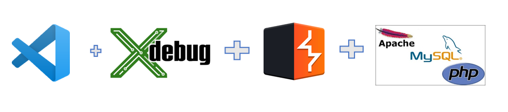
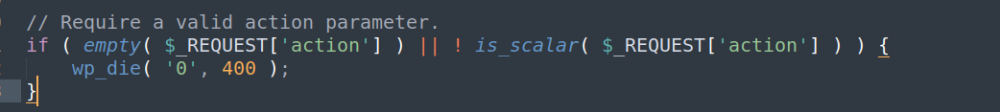
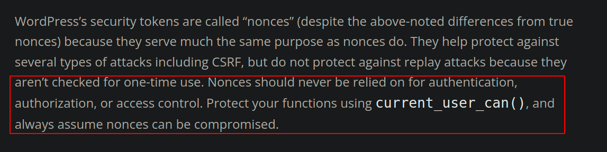
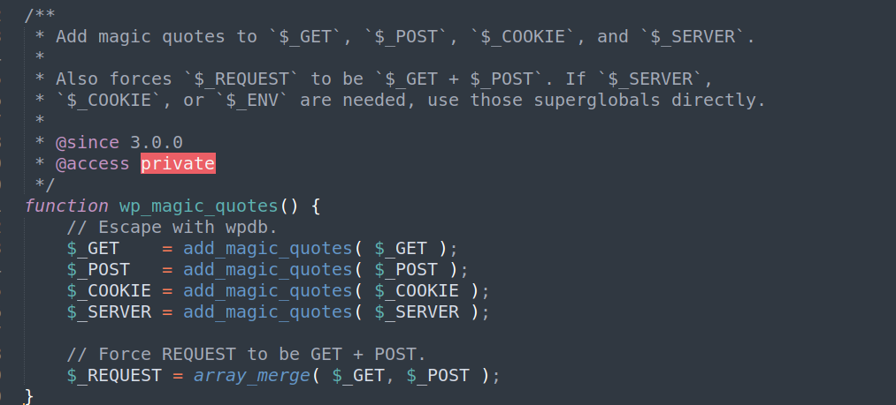
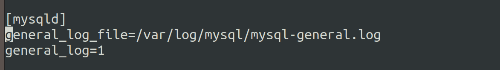

# Manual Source Code Review of WordPress Plugins

You can watch the presentation here:
[Manual Source Code Review on WordPress Plugins](https://youtu.be/fpBvULQCxVE)

**Introduction** 

[WordPress plugins](https://wordpress.org/plugins/) are packages of code that can be added to a WordPress website to extend its functionality. They are designed to enhance the core features of WordPress.

Manual source code review(SCR) is a process of manually examining the source code of an application or software to identify any security vulnerabilities, bugs, or code quality issues.

This paper focuses on different approaches to manually reviewing WordPress Plugins, some exciting scenarios/vulnerabilities reported, and using PHPCS or semgrep ruleset for streamlining some of the processes. 

**Table of Contents**

## Setting up the environment



### Burpsuite

- Install the Burpsuite using the official [download-and-install](https://portswigger.net/burp/documentation/desktop/getting-started/download-and-install) link.

### Installing the Plugin and Setting up the Debugger

- Set up the [WordPress](https://wordpress.org/documentation/article/how-to-install-wordpress/) and download the WP Plugins from the [official WordPress plugin page](http://wordpress.org/plugins/) into the “**/wp-content/plugins**” directory.
- You can also download the plugin directly from the plugins page available in the wp-admin section.
- Activate the installed plugin by navigating to the “Installed plugin” section.
- Open the installed plugin directory into the VSCode.
- Install the [XDebug](https://xdebug.org/docs/install) for debugging the PHP code.
- You can also use the [XDebug wizard](https://xdebug.org/wizard) for installing the XDebug to ease the installation or if you are facing any problems.
- Enable the Xdebug and add the [develop and step debugging mode](https://xdebug.org/docs/all_settings#mode).
- Below is the configuration file's content for XDebug
    
    ```php
    zend_extension=xdebug.so
    xdebug.mode=develop,debug
    xdebug.start_with_request=yes
    ```
    
- Install the [PHP Debug](https://github.com/xdebug/vscode-php-debug) Extension in the VSCode, create a “launch.json” file debugging, and start debugging.
- If the installations are proper, you will see that the debugger has started.

## Reviewing the code

### Entry Point of the plugin

Every plugin has one main PHP file in which the header fields are mentioned as comments.

This is how WordPress knows it's a plugin; you will see the same metadata in the “plugin” section on the admin page.

 “**Plugin Name”** is a mandatory field, while other fields are optional in the [Header Field.](https://developer.wordpress.org/plugins/plugin-basics/header-requirements/#header-fields)

### Code Structure

WordPress defines no proper structure to develop a plugin. That’s why you will often see different structures followed for developing different plugins.

Some of the common structures are:

- [MVC](https://en.wikipedia.org/wiki/Model%E2%80%93view%E2%80%93controller)
- [SLASH](https://jjj.blog/2012/12/slash-architecture-my-approach-to-building-wordpress-plugins/)

### Techniques for looking into the code

Below are some quick ways to look into the plugin for specific vulnerabilities or just to get an idea of the security standards of the plugins.

- **Authentication**
    
    Authentication is handled by the WordPress core itself for all the plugins.
    
- **Authorization**
    
    [wp_ajax_{action}](https://developer.wordpress.org/reference/hooks/wp_ajax_action/) and [wp_ajax_nopriv_{action}](https://developer.wordpress.org/reference/hooks/wp_ajax_action/) hooks are used to handle the custom AJAX call from the “**wp-admin/admin-ajax.php**” page.
    
    [wp_ajax_{action}](https://developer.wordpress.org/reference/hooks/wp_ajax_action/): Any authorized user can fire this hook.
    
    [wp_ajax_nopriv_{action}](https://developer.wordpress.org/reference/hooks/wp_ajax_action/): This hook is for an unauthorized user.
    
    [add_action](https://developer.wordpress.org/reference/functions/add_action/): This function adds the callback function to the hook.
    
    [**action**](https://developer.wordpress.org/plugins/javascript/ajax/#action): This parameter should be mentioned in the request in order to call the defined hook defined in the plugin.
    
    
    
    [**Nonce**](https://developer.wordpress.org/apis/security/nonces/#why-use-a-nonce): This randomly generated string is used to prevent vulnerabilities like [CSRF](https://owasp.org/www-community/attacks/csrf). This can be used more than once and has a default expiry of one day(24 hr).
    
    This token is tied to the currently logged-in user. That’s why you will often observe this token being used as authorization in different endpoints in the code. However, WordPress mentions that this should not be used as an authorization check.
    
    
    
    [**wp_create_nonce**](https://developer.wordpress.org/reference/functions/wp_create_nonce/): This function is used to create the nonce.
    
    [**check_ajax_referer**](https://developer.wordpress.org/reference/functions/check_ajax_referer/): This function is used to verify the nonce in the AJAX request. Observe the **last argument($die)** of this function. By default, it's set to **True**. If it's set to **False**, it will not cause the script to die, making the **check useless**.
    
    Explore different endpoints and examine the implementation of authorization in the code.
    
    If the developer is using nonce for authorization, examine where precisely the nonce is getting created using **[wp_create_nonce](https://developer.wordpress.org/reference/functions/wp_create_nonce/)** and any possibility of leaking the nonce. 
    
    You can refer to [**Nonce leak+ Any authorized user calling the endpoints**](https://www.notion.so/Manual-Source-Code-Review-of-WordPress-Plugins-15ecfb40d0f24c2897d0097f32756336?pvs=21) finding for one such scenario.
    
    [**WordPress Rest API**](https://developer.wordpress.org/rest-api/)
    
    [rest_api_init](https://developer.wordpress.org/reference/hooks/rest_api_init/) hook is used for adding the API endpoints.
    
    [rest_api_init](https://developer.wordpress.org/reference/hooks/rest_api_init/) hook is used for adding the API endpoints.
    
    [register_rest_route](https://developer.wordpress.org/reference/functions/register_rest_route/) function is used for registering the custom routes. Look into the **permission_callback** function if implemented to check for the authorization part.
    
    The defined endpoint is public if the permission callback is not defined or **returns true**.
    
- **SQL Injection (SQLi)**
    
    Examine different methods of [**wpdb class**](https://developer.wordpress.org/reference/classes/wpdb/), which is used for interacting with the databases.
    
    Some of the methods like [**$wpdb->prepare()**](https://developer.wordpress.org/reference/classes/wpdb/#protect-queries-against-sql-injection-attacks) are safe if used correctly, and other methods like [**$wpdb->query()**](https://developer.wordpress.org/reference/classes/wpdb/#running-general-queries) are unsafe.
    
    All the unsafe methods are found in the [**WP Plugin SQLi**](https://semgrep.dev/playground/r/php.wordpress-plugins.security.audit.wp-sql-injection-audit.wp-sql-injection-audit) semgrep rule.
    
    WordPress core, by default, adds the **magic quotes** in the request. This behavior prevents SQLi in some of the plugins.
    
    
    
    
    WordPress/wp-includes/load.php#L1101-1110
    
    I have seen some of the plugins vulnerable to SQLi, but I could not exploit it due to this behavior.
    
    Developers usually use [wp_unslash](https://developer.wordpress.org/reference/functions/wp_unslash/) to remove the extra slash(escaping) added by WordPress.
    
    Another way is to turn on the logging of the MySQL database.
    
    Include the below system variables in the MySQL configuration file.
    
    [general_log](https://dev.mysql.com/doc/refman/8.0/en/server-system-variables.html#sysvar_general_log)
    
    [general_log_file](https://dev.mysql.com/doc/refman/8.0/en/server-system-variables.html#sysvar_general_log_file)
    
    By default, mysql.conf file is located in the /etc/mysql directory in Linux OS.
    
    
    
    Monitor the log file for some unique string like “uniqueString”
    
    Now explore the plugin's functionality, and in the input fields, enter some unique String like “uniqueString.”
    
    Observe the SQL queries and your payload “uniqueString”  in the logs.
    
    
    
    You can try to break the formed SQL queries shown in the logs depending on the queries using chars like **single quotes(’), double quotes(”), etc., or directly appending the keywords like “union**.”
    
    Observe whether the payload like “ **uniqueString’** ”, “ **unqiueString”** ” is getting properly escaped or not for detecting and exploiting the SQLi. 
    
    
    
- **Cross-Site Scripting (XSS)**
    
    By default, users with admin or Editor roles are allowed to add [unfiltered HTML](https://make.wordpress.org/core/handbook/testing/reporting-security-vulnerabilities/#why-are-some-users-allowed-to-post-unfiltered-html).
    
    When testing for XSS, make sure that you test with other roles like contributor, author, etc.
    
    You can also disable the default behavior for Admin and Editor by placing the below content in the **wp-config.php** file
    
    `define( 'DISALLOW_UNFILTERED_HTML', true );`
    
- **Functionality Wise**
    
    You can start exploring the plugin functionality and see if something looks interesting, like Updating any value, importing or exporting the files, Adding custom snippets, etc.
    
    Observe the endpoint responsible for the same and start looking into the source code. 
    
    [**Set up some breakpoints**](https://www.notion.so/Manual-Source-Code-Review-of-WordPress-Plugins-15ecfb40d0f24c2897d0097f32756336?pvs=21) in the code for interacting with the code if some of the code/logic implemented is not easy to understand.
    
- **PHPCS Filters**
    
    Most of the plugins use [**PHPCS**](https://github.com/squizlabs/PHP_CodeSniffer) to maintain the coding standard.
    
    You can look for strings like “**[phpcs:ignore](https://github.com/squizlabs/PHP_CodeSniffer/wiki/Advanced-Usage#ignoring-parts-of-a-file)**”, “**[phpcs:ignoreFile](https://github.com/squizlabs/PHP_CodeSniffer/wiki/Advanced-Usage#ignoring-files-and-folders)**”, “**[phpcs:disable](https://github.com/squizlabs/PHP_CodeSniffer/wiki/Advanced-Usage#ignoring-files-and-folders)**”, etc. in the plugin code. If the developer uses [**PHPCS**](https://github.com/squizlabs/PHP_CodeSniffer) and the ruleset has found some violations, the above filters ignore the violations.
    
    This can be helpful in cases where the PHPCS has reported any possible security-related issues, and the developer has used the filters to ignore the issue.
    
    All the supported filters can be found [**here**](https://github.com/squizlabs/PHP_CodeSniffer/wiki/Advanced-Usage)
    
- **Additional Information**
    
    Below are some more functions which are frequently used in the WP plugin development.
    
    [add_menu_page](https://developer.wordpress.org/reference/functions/add_menu_page/)
    
    [add_submenu_page](https://developer.wordpress.org/reference/functions/add_submenu_page/)
    
    [current_user_can](https://developer.wordpress.org/reference/functions/current_user_can/)
    
    [check_admin_referral](https://developer.wordpress.org/reference/functions/check_admin_referer/)
    
    [add_filter](https://developer.wordpress.org/reference/functions/add_filter/)
    
    [apply_filters](https://developer.wordpress.org/reference/functions/apply_filters/)
    
    [add_shortcode](https://developer.wordpress.org/reference/functions/add_shortcode/)
    
    [apply_shortcodes](https://developer.wordpress.org/reference/functions/apply_shortcodes/)
    

## Vulnerabilities Reported(8 CVEs)

I reported 12 vulnerabilities after manually reviewing different plugins, and 8 of them were triaged by the WPScan team. Other reported vulnerabilities were intended features in the plugin or required another vulnerability for the impact.

You can have a look at the reported vulnerabilities with the detailed report and the vulnerable code snippets available at the below GitHub link.

[https://github.com/p3n7a90n/WPPluginsVulnerabilitiesReported](https://github.com/p3n7a90n/WPPluginsVulnerabilitiesReported)

### Interesting scenarios

Below are some exciting scenarios I came across, which I think are hard to find without the manual SCR.

- **Authorized user + Code Injection and Sqli in WP ALL import PRO**
    
    In this plugin, It was possible for users other than the admin to do RCE and SQLi.
    Blog Link: [**https://payatu.com/blog/wp-all-export-pro/**](https://payatu.com/blog/wp-all-export-pro/)
    
- **Nonce leak+ Any authorized user calling the endpoints in WPCode**
    
    In this plugin, some endpoints were relying on the nonce for the authorization, and it was possible to leak the nonce to any authenticated user and call different endpoints.
    
    Report Link: [**https://github.com/p3n7a90n/WPPluginsVulnerabilitiesReported/tree/main/insert-headers-and-footer/Nonce leak%2B Any authorized user calling the endpoints**](https://github.com/p3n7a90n/WPPluginsVulnerabilitiesReported/tree/main/insert-headers-and-footer/Nonce%20leak%2B%20Any%20authorised%20user%20calling%20the%20endpoints)
    
- **Admin + Sqli in Elementor**
    
    In this plugin, one of the endpoints data was directly being used in the SQL Query after validating it with a “” which was easy to bypass.
     Nonce is being used for authorization, and the nonce is accessible only in the admin area.
    
    Report Link: 
    
    [**https://github.com/p3n7a90n/WPPluginsVulnerabilitiesReported/tree/main/elementor/Admin %2B Sqli in Replace URL Module](https://github.com/p3n7a90n/WPPluginsVulnerabilitiesReported/tree/main/elementor/Admin%20%2B%20Sqli%20in%20Replace%20URL%20Module)** 
    
- **Freemius key leak in Anywhere Elementor could lead to obtaining a PRO subscription for free**
    
    In this Plugin, PRO plugin subscriptions are handled via [**Freemius**](https://freemius.com/). Freemius API Key was hardcoded and commented out in the code, which can be used to buy the PRO subscription using test credit cards.  
    
    Report Link: [**https://github.com/p3n7a90n/WPPluginsVulnerabilitiesReported/tree/main/anywhere-elementor/Freemius Key leak in Anywhere Elementor which could lead to buying PRO subscription for free**](https://github.com/p3n7a90n/WPPluginsVulnerabilitiesReported/tree/main/anywhere-elementor/Freemius%20Key%20leak%20in%20Anywhere%20Elementor%20which%20could%20lead%20to%20buying%20PRO%20subscription%20for%20free)
    

## Automation

### PHP Code Sniffer

It’s a [**tool**](https://github.com/squizlabs/PHP_CodeSniffer) that detects violations of the rules defined in the ruleset.

[**WordPress-Coding-Standards**](https://github.com/WordPress/WordPress-Coding-Standards) has some security relates [PHPCS](https://github.com/squizlabs/PHP_CodeSniffer) rulesets that can be used for detecting possible security-related issues.

```php
./vendor/bin/phpcs --standard=WordPress --sniffs=WordPress.CSRF.NonceVerification,WordPress.DB.PreparedSQL,WordPress.DB.PreparedSQLPlaceholders,WordPress.DB.RestrictedClasses,WordPress.DB.RestrictedFunctions,WordPress.Security.NonceVerification,WordPress.Security.PluginMenuSlug,WordPress.Security.SafeRedirect,WordPress.Security.ValidatedSanitizedInput,WordPress.WP.PreparedSQL,WordPress.XSS.EscapeOutput /path/to/plugin/
```

### Semgrep Rules

I contributed to the WordPress plugin semgrep rules based on the [WPScan-Cheat-Sheet-Wiki](https://github.com/wpscanteam/wpscan/wiki/WordPress-Plugin-Security-Testing-Cheat-Sheet)

You can find all the rules in a single ruleset [**WordPress**](https://semgrep.dev/p/wordpress)

Run the semgrep rules on any plugins for reviewing the plugins for possible security-related vulnerabilities.

Semgrep result will give you an idea of the code standard of the plugin and possible vulnerable locations where you can directly look for the vulnerability.

You can run all the WP Plugins semgrep rules after setting up the semgrep by running

`semgrep --config p/wordpress` 

Observe the path of all the WP Plugins rules. This is done to limit the rules to WordPress plugins only.


Run the semgrep from the one directory before the **wp-content** directory to follow the path structure.

If there are multiple plugins inside the plugins directory and you want to run the rules for one of them, you can add the other plugin directory in the “.[**semgrepignore**](https://semgrep.dev/docs/ignoring-files-folders-code/)” file to ignore the other plugins.

## Reporting the Vulnerabilities

You can directly contact the developer or report the vulnerability to the [WPScan](https://wpscan.com/submit) team.

You can read more about the WPScan submission terms [here](https://wpscan.com/submission-terms).

## Important Links

- [https://make.wordpress.org/core/handbook/testing/reporting-security-vulnerabilities/](https://make.wordpress.org/core/handbook/testing/reporting-security-vulnerabilities/)
- [https://github.com/wpscanteam/wpscan/wiki/WordPress-Plugin-Security-Testing-Cheat-Sheet](https://github.com/wpscanteam/wpscan/wiki/WordPress-Plugin-Security-Testing-Cheat-Sheet)
- [https://wordpress.org/documentation/article/roles-and-capabilities/](https://wordpress.org/documentation/article/roles-and-capabilities/)
- [https://github.com/erwanlr/wordpress_plugin_security_testing_cheat_sheet](https://github.com/erwanlr/wordpress_plugin_security_testing_cheat_sheet)
- [https://github.com/returntocorp/semgrep-rules/pull/2549](https://github.com/returntocorp/semgrep-rules/pull/2549)
- [https://developer.wordpress.org/plugins/intro/](https://developer.wordpress.org/plugins/intro/)

## About the Author

Sanjay Das([p3n7a90n](https://twitter.com/p3n7a90n))

Security Consultant [**@payatu**](https://payatu.com/)

Website: [https://p3n7a90n.github.io/](https://p3n7a90n.github.io/)